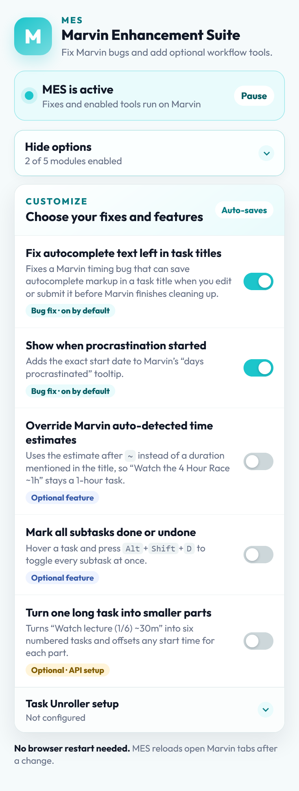
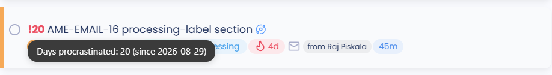

<p align="center">
  
</p>

<h1 align="center">Marvin Enhancement Suite</h1>

<p align="center"><strong>Fix what gets in your way. Add what Marvin is missing.</strong></p>

<p align="center">
  <a href="https://github.com/rajpiskala/marvin-enhancement-suite/actions/workflows/ci.yml"></a>
  
  <a href="LICENSE"></a>
  <a href="https://github.com/sponsors/rajpiskala"></a>
</p>

<p align="center">
  <a href="#features">Features</a> ·
  <a href="#installation">Installation</a> ·
  <a href="#privacy-and-permissions">Privacy</a> ·
  <a href="#development">Development</a>
</p>

<p align="center">
  
</p>

Marvin Enhancement Suite (MES) is the unofficial browser extension for a smoother [Amazing Marvin](https://amazingmarvin.com/) experience. It fixes stubborn browser bugs and adds practical workflow upgrades, with every module—including default-on fixes—independently toggleable from the toolbar popup. Changes apply by reloading open Marvin tabs; a browser restart is never required.

MES is independent and is not produced, sponsored, or endorsed by Amazing GmbH.

## Features

| Module | Default | What it does |
| --- | --- | --- |
| Fix autocomplete text left in task titles | On | Stops Marvin's internal autocomplete markup from being saved into task names. |
| Show when procrastination started | On | Adds the exact start date to Marvin's “days procrastinated” tooltip. |
| Override Marvin auto-detected time estimates | Off | Uses your explicit `~` estimate instead of a duration Marvin finds in the title. |
| Mark all subtasks done or undone | Off | Toggles every subtask at once with `Alt+Shift+D`. |
| Turn one long task into smaller parts | Off | Expands one numbered task into a satisfying series of smaller tasks. |

Task Unroller is the only module that needs Marvin API credentials. Its setup appears inside the popup only when you want it; MES never blocks first launch or unrelated features on an API key.

### (1) Fix autocomplete text left in task titles

Marvin briefly leaves internal autocomplete markup in the task input after you choose something such as `+Today` or `#health`. A delayed cleanup hook is supposed to remove it. If you edit or submit the task before that hook finishes—especially while typing quickly or backspacing—the extra autocomplete content can be saved as part of the title.

MES makes that cleanup safe and immediate, so the selected date, category, or label still applies without its internal formatting leaking into the task name.

### (2) Show when procrastination started

Marvin can tell you that a task has been procrastinated for a certain number of days, but that makes you calculate the original date yourself. MES adds the exact start date to the existing hover tooltip.

<p align="center">
  
</p>

### (3) Override Marvin auto-detected time estimates

Marvin treats duration-like phrases anywhere in a title as a time estimate. That is helpful until the duration is part of the name rather than the work:

```text
Watch the 4 Hour Race ~1h
```

Without this module, Marvin can auto-detect `4 Hour` and make it a four-hour task. With the module enabled, the explicit `~1h` wins, so the task keeps the intended one-hour estimate. It also avoids inventing an estimate for a new task that contains a duration-like phrase but no explicit `~` estimate. Estimates set manually through Marvin's controls are preserved.

### (4) Mark all subtasks done or undone

Hover the parent task and press `Alt+Shift+D`. MES marks every unfinished subtask done; use the same shortcut again to mark them all undone. This is useful when the parent task and all of its subtasks should move together.

### (5) Turn one long task into smaller parts

A single three-hour task can feel strangely unrewarding: you work for a long time without getting to finish anything. Task Unroller lets you describe the first part once and creates the rest for you.

Create a new Marvin task like this:

```text
Watch a really long lecture part (1/6) ~30m
```

MES keeps that as part `(1/6)` and creates parts `(2/6)` through `(6/6)`, each with the same metadata and 30-minute estimate. You get six concrete stopping points without copying the task or editing every number by hand.

Start the title with a time and MES schedules the parts back to back:

```text
3:00pm Watch a really long lecture part (1/6) ~30m
```

The generated series starts at `3:00pm`, `3:30pm`, `4:00pm`, `4:30pm`, `5:00pm`, and `5:30pm`. You can also use range syntax such as `Review lecture notes $1..6`. MES watches only newly created tasks, prevents accidental duplicate expansion, confirms unusually large runs, and offers **Undo latest unroll** in the popup.

Enable Task Unroller and open its setup section to add the two credentials from **Marvin → Features/Strategies → API → View credentials**. The other four modules never need those credentials.

## Installation

Chrome Web Store and Firefox Add-ons releases are being prepared. Store links will replace this note after the first reviews are complete.

To test the current source build:

```console
npm ci
npm run release
```

- Chrome or Edge: open the extensions page, enable Developer mode, choose **Load unpacked**, and select `.output/chrome-mv3`.
- Firefox: open `about:debugging#/runtime/this-firefox`, choose **Load Temporary Add-on**, and select `.output/firefox-mv2/manifest.json`.

Temporary Firefox add-ons are removed when Firefox restarts.

## Browser support

- Chrome and Chromium desktop browsers: Manifest V3.
- Firefox desktop 142 or newer: Manifest V2.
- Amazing Marvin's native desktop and mobile apps: not supported.
- Firefox Android: not currently supported or listed.

## Privacy and permissions

MES has no analytics, advertising, telemetry, remote code, or maintainer-operated server. Its required access is limited to Amazing Marvin's web app.

Four modules process task UI information locally. Task Unroller is off by default and separately requests access to Marvin's API. Its optional credentials stay in extension-local storage and requests go directly to Amazing Marvin over HTTPS.

See [PRIVACY.md](PRIVACY.md) for the complete data-handling explanation and [SECURITY.md](SECURITY.md) for the security model.

## Development

Requirements: Node.js 22.13 or newer and npm 10 or newer.

```console
npm ci
npm run check
```

`npm run release` adds Mozilla linting, versioned Chrome and Firefox packages, an AMO reviewer source archive, and byte-for-byte artifact verification. See [testing](docs/testing.md), [publishing](docs/publishing.md), and [contributing](CONTRIBUTING.md) for the short operational guides.

To create a folder containing exactly what each marketplace needs:

```console
npm run marketplace:prepare
```

Open `.output/marketplace/UPLOAD-CHECKLIST.md` for the exact Chrome Web Store and Firefox Add-ons upload mapping. The folder includes the verified browser packages, Firefox source archive, listing copy, icon, screenshot, promotional graphics, and SHA-256 checksums.

## Support

If this project saved you some time, fixed something annoying, or made your workflow a little better, you can [sponsor my open-source work](https://github.com/sponsors/rajpiskala). Everything here stays free and open source. 💗

## License

[MIT](LICENSE)
